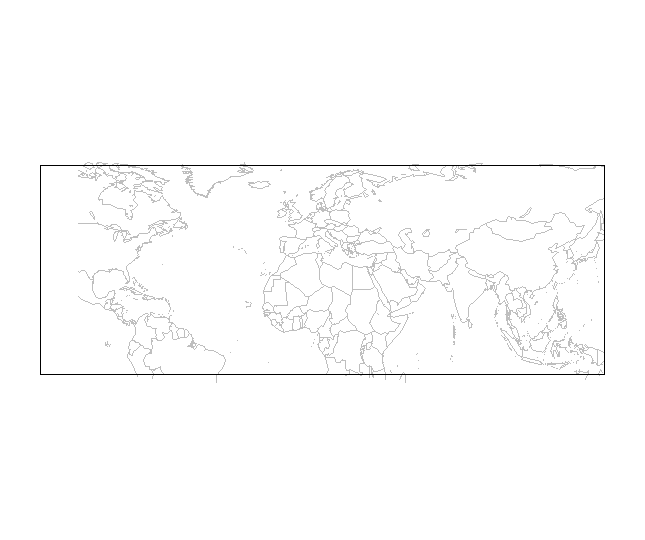
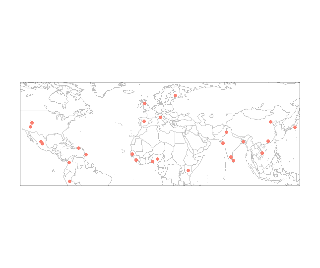
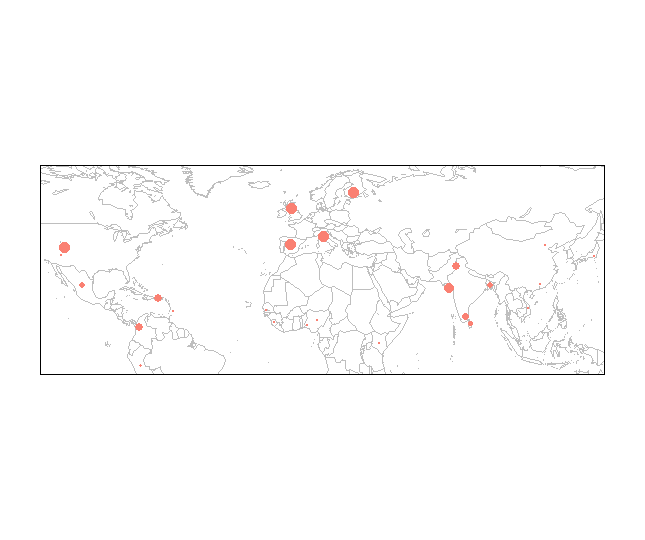
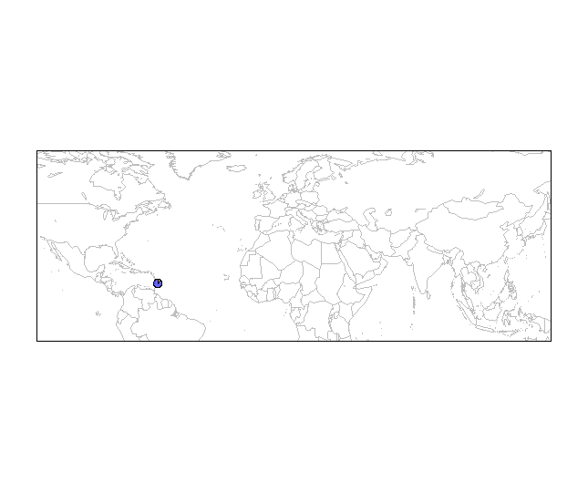
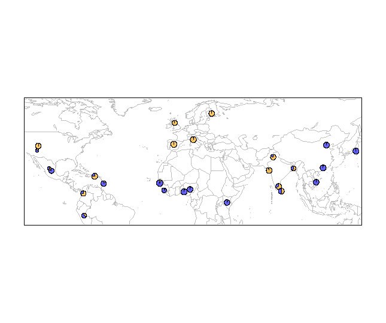
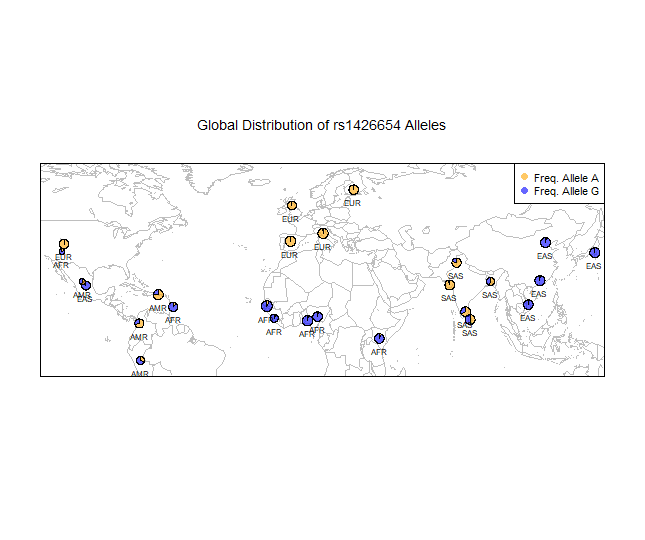

## 1.  Installation of packages
```r 
 install.packages('maps')
 install.packages('mapplots')
 install.packages('mapdata')
 install.packages('scales')
 library(maps)
 library(mapdata)
 library(mapplots)
 library(scales)
 ```
 
 
## 2.  World map layer
```r
 map('worldHires', xlim=c(-120,142), ylim=c(-12,72), col='gray', fill=FALSE)
 box()
```

<center>
</img>


## 3.  Plot human populations
```r
 map('worldHires', xlim=c(-120,142), ylim=c(-12,72), col='gray', fill=FALSE)
 points(freq$long, freq$lat, pch=16, col="salmon")
 box()
 ```
 
 <center>
 </img>
 
 
 ## 4.  Adjust point size
 ```r
 map('worldHires', xlim=c(-120,142), ylim=c(-12,72), col='gray', fill=FALSE)
 points(freq$long, freq$lat, pch=16, cex=freq$Allele_A*1.5, col="salmon")
 box()
 ```
 
 <center>
 </img>
 
 ## 5.  Pie charts
 ```r
 map('worldHires', xlim=c(-120,142), ylim=c(-12,72), col='gray', fill=FALSE)
 add.pie(z=c(0.104, 0.895), x=-59.5412, y=13.1776, radius=192/100, 
            col=c(alpha("orange", 0.6), alpha("blue", 0.6)), labels="")
 box()
```

<center>
</img>

## 6.  For loop
```r
  map('worldHires', xlim=c(-120,142), ylim=c(-15,72), col='gray', fill=FALSE)
  for (i in 1:26){add.pie(z=c(freq$Allele_A[i], freq$Allele_G[i]), x=freq$long[i], y=freq$lat[i], 
        radius=freq$N_CHR[i]/100, col=c(alpha("orange", 0.6), alpha("blue", 0.6)), labels="")
  i=i+1
}
  box()
```

<center>
</img>

## 7.  Legend and labels
```r
 map('worldHires', xlim=c(-120,142), ylim=c(-15,72), col='gray', fill=FALSE)
 for (i in 1:26){
  add.pie(z=c(freq$Allele_A[i], freq$Allele_G[i]), x=freq$long[i], y=freq$lat[i], 
        radius=freq$N_CHR[i]/100, col=c(alpha("orange", 0.6), alpha("blue", 0.6)), labels="")
  i=i+1
}
 text(freq$long, freq$lat, labels=freq$superpop, cex=0.5, pos=1)
 box()
 legend('topright', bty='1', c("Freq. Allele A", "Freq. Allele G"), 
        pch=16, col=c(alpha("orange", 0.6), alpha("blue", 0.6)), pt.cex=1, cex=0.7)
 title(main="Global Distribution of rs1426654 Alleles", font.main=1, cex.main=0.9)
```

<center>
</img>

 

 


